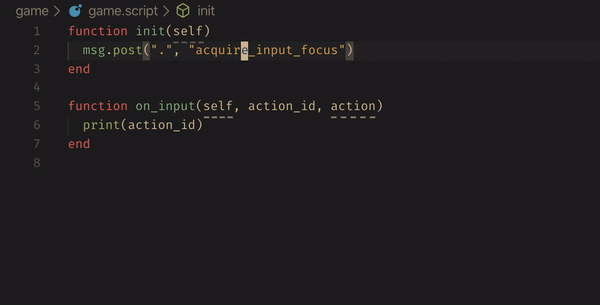

# Defold IDE

> This extension is a work in progress. It may be useful to you as it is, but it's far from a stable state and things might change.

Up-to-date autocomplete, API docs, snippets and more for the Defold game engine.

## Features

### Autocomplete and documentation

> TODO. Not implemented yet, but planned.

### Snippets

> TODO. Not implemented yet, but planned.

### Refactor hashes as constants

Replaces strings and literal hashes with local variables declared at the
top of the file. With the following keymaps, select or place your cursor 
on a hash string, then press `<leader>h`:

```vim
nnoremap <leader>h :CocCommand defold-ide.refactorHash<CR>
vnoremap <leader>h :CocCommand defold-ide.refactorHashVisual<CR>
```



If your project doesn't use this style of hash constants, you can customise
prefix, capitalisation and even make Defold IDE create hash constants in
a separate module instead of using local variables.

Don't forget that you can also configure CoC settings per-workspace. 
Different projects can configure this extension differently.
